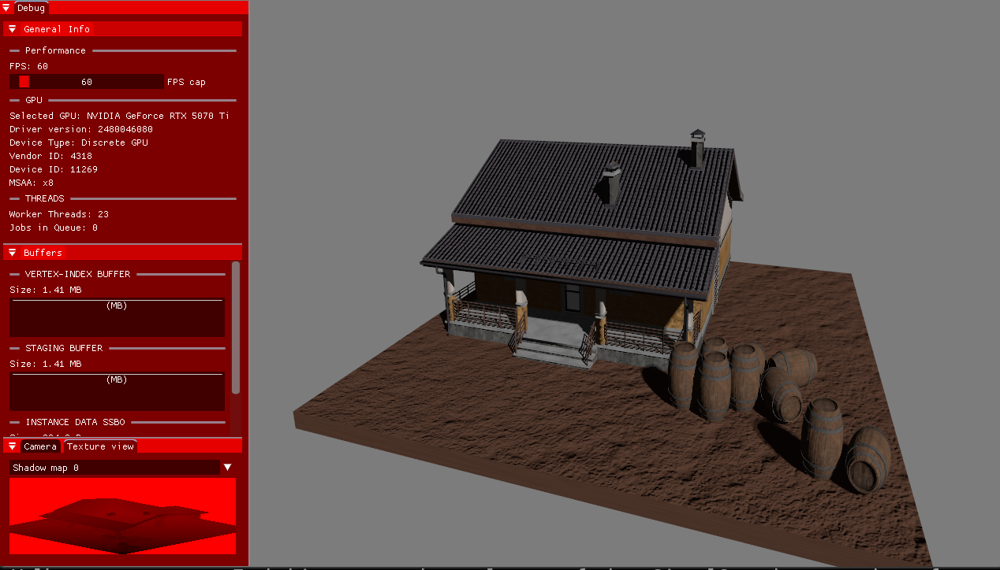

# PROMETHEUS GRAPHICS ENGINE

> **License Notice**  
> This repository is free to use. It includes third-party libraries such as ImGui and tinyobjloader, which are also free to use.  
> Please read the included license files for details.

## Description

Prometheus is a personal hobby graphics engine built with Vulkan.  
It is lightweight, designed for small scenes, and supports features such as **normal mapping**, **shadow mapping**, and **complex geometry**.

The engine is actively developed and continuously enriched with features commonly found in mainstream engines.  
Check the feature list below to see what is currently implemented and what is planned next.

### 1. Use Cases

- Small illustrations without much overhead
- Boilerplate for graphics programming with Vulkan
- Small but fun projects like uni assignments

### 2. Stack

- Developed on Windows
- C/C++
- Libraries used
	- [Dear ImGui v1.92.5 (docking branch)](https://github.com/ocornut/imgui/tree/docking)
	- [stb_image](https://github.com/nothings/stb/blob/master/stb_image.h) + [stb_image_write](https://github.com/nothings/stb/blob/master/stb_image_write.h)
	- [tiny_obj_loader](https://github.com/tinyobjloader/tinyobjloader/blob/release/tiny_obj_loader.h)
	- [VulkanSDK v1.4.335.0](https://vulkan.lunarg.com/)
	- [glfw v3.4](https://www.glfw.org/)
	- [glm v1.0.2](https://github.com/g-truc/glm)
- CMAKE (minimum required 3.10)

### 3. Platforms

- Windows ✅ (I recommend Visual Studio Community edition 2026)
- Linux ⚠️ (Probably, not tested though)
- Mac ⚠️ (No idea I can't test it since i don't have a device)

# USAGE

1. Clone the repo
1. Download the necessary libraries listed below. The rest are included as header files or cpp files inside the project
	- glm
	- glfw
	- VulkanSDK
1. Change the file paths in these lines to the ones corresponding to your machine
	> **⚠️ Important**  
	> I **strongly advise** not modifying the first three directory definitions or the `GLOB_RECURSE` lines.  
	> These directories are part of the project structure and changing them may cause build issues.
	```cmake
	set(BIN_DIR "${CMAKE_SOURCE_DIR}/bin")
	set(MODEL_DIR "${CMAKE_SOURCE_DIR}/models")
	set(TEXTURE_DIR "${CMAKE_SOURCE_DIR}/textures")

	file(GLOB_RECURSE SOURCES "src/*.cpp" "src/*.h")

	add_executable(Prometheus ${SOURCES})

	target_include_directories(Prometheus PUBLIC
		"C:/Users/Dimitris/Documents/Libraries/VulkanSDK/1.4.335.0/Include"
		"C:/Users/Dimitris/Documents/Libraries/glfw-3.4/include"
		"C:/Users/Dimitris/Documents/Libraries/glm1.0.2"
	)

	target_link_libraries(Prometheus PUBLIC
		"C:/Users/Dimitris/Documents/Libraries/VulkanSDK/1.4.335.0/Lib/vulkan-1.lib"
		"C:/Users/Dimitris/Documents/Libraries/glfw-3.4/lib-vc2022/glfw3.lib"
	)
	```
1. Compile and run to see the demo scene.
- Make sure to move around with WASD and hold the right mouse button with mouse movement to rotate the camera!
- Click the camera window on the bottom left to adjust some camera settings.


# FEATURES

## Implemented
- Shadow Maps with pcss
- Normal Maps
- Color Maps
- Real-time rendering
- Multithreaded object deletion and creation
- MSAA
- Point lights & Directional lights
- Dockable GUI

## In progress
- Debug line drawing
- Collisions
- Cascading shadow maps
- Scene tree window
- Real-time scene editing

# FUTURE CHANGES

- More than just .obj model formats
- Ray-tracing (Path tracing)
- Emission maps etc.
- Reflections
- Particle effects
- Animations

# CONTROLS
## You can change these inside *inputManager.cpp*
- Spacebar to hide or show GUI
- WASD keys for camera movement + RF for up or down
- Scroll wheel for camera acceleration adjustment
- Horizontal scroll for camera FOV adjustment